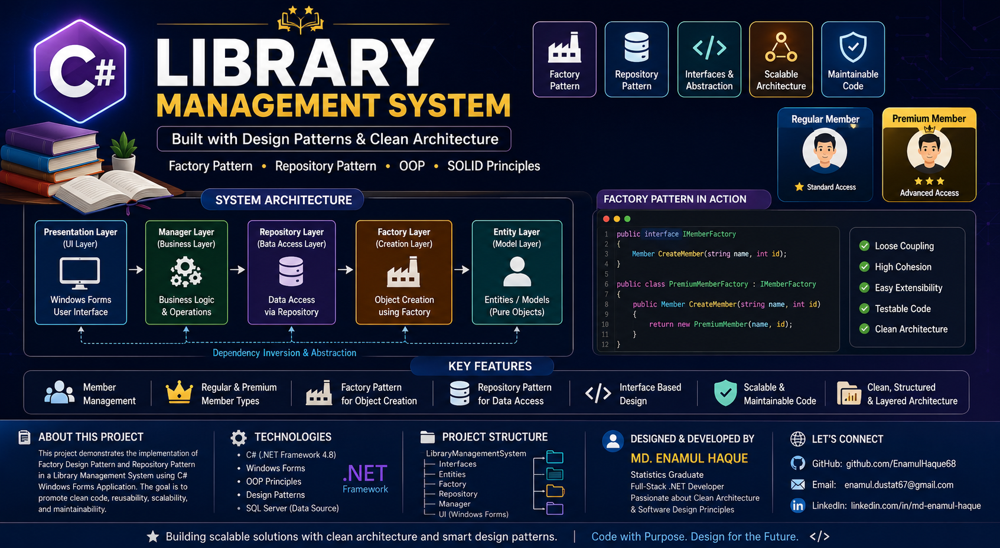

<p align="center">
  
</p>

<h1 align="center">📚 Library Management System</h1>

<h3 align="center">
Built with C# • Windows Forms • Factory Pattern • Repository Pattern • Clean Architecture
</h3>

<p align="center">
A professional desktop application demonstrating modern software engineering principles, design patterns, and maintainable architecture for library management.
</p>

<p align="center">


</p>

---

# 📖 Project Overview

This project is a desktop-based **Library Management System** developed using **C# Windows Forms** following modern software engineering practices. It demonstrates the implementation of **Factory Pattern**, **Repository Pattern**, **Interface-Based Programming**, and **Layered Architecture** to build a scalable, reusable, and maintainable application.

The system efficiently manages library members while promoting clean code, loose coupling, high cohesion, and object-oriented design principles.

---

# ✨ Key Features

- 👥 Member Management
- 👑 Regular & Premium Member Types
- 🏭 Factory Pattern Implementation
- 📦 Repository Pattern
- 🔗 Interface-Based Design
- 🏗️ Layered Architecture
- ♻️ Reusable Business Logic
- 🛡️ Clean & Maintainable Code
- 🚀 Scalable Application Structure
- 💻 Windows Desktop Application

---

# 🏛️ System Architecture

The project follows a clean layered architecture:

```text
Presentation Layer (Windows Forms UI)
                │
                ▼
Business Layer (Manager)
                │
                ▼
Repository Layer (Data Access)
                │
                ▼
Factory Layer (Object Creation)
                │
                ▼
Entity Layer (Models)
```

This architecture separates responsibilities, improves maintainability, and supports future scalability.

---

# 🧩 Design Patterns Used

## 🏭 Factory Pattern

The Factory Pattern is used to create different member objects (e.g., Regular Member and Premium Member) without exposing the object creation logic to the client.

### Benefits

- Encapsulates object creation
- Reduces code duplication
- Easy to extend with new member types
- Promotes loose coupling

---

## 📦 Repository Pattern

The Repository Pattern abstracts data access logic from business logic, making the application easier to maintain, test, and modify.

### Benefits

- Centralized data access
- Separation of concerns
- Improved code reusability
- Easier unit testing

---

# 🛠️ Technology Stack

| Category | Technology |
|----------|------------|
| Language | C# |
| Framework | .NET Framework 4.8 |
| UI | Windows Forms |
| Design Patterns | Factory Pattern, Repository Pattern |
| Architecture | Layered Architecture |
| Principles | OOP, SOLID, Interface-Based Design |

---

# 📂 Project Structure

```text
LibraryManagementSystem
│
├── Interfaces
├── Entities
├── Factory
├── Repository
├── Manager
├── UI (Windows Forms)
└── Program.cs
```

---

# 🎯 Learning Outcomes

This project demonstrates practical knowledge of:

- Object-Oriented Programming (OOP)
- SOLID Principles
- Factory Design Pattern
- Repository Design Pattern
- Interface-Based Programming
- Layered Architecture
- Clean Code Practices
- Scalable Desktop Application Development

---

# 🚀 Future Improvements

- SQL Server Integration
- Book Management Module
- Borrow & Return Module
- Authentication & Authorization
- Dashboard & Analytics
- Report Generation
- Unit Testing

---

# 👨‍💻 Developer

**MD. ENAMUL HAQUE**

🎓 Statistics Graduate – University of Dhaka

💼 Full-Stack .NET Developer

📊 Data Analyst

📧 Email: enamul.dustat67@gmail.com

🔗 GitHub: https://github.com/EnamulHaque68

🔗 LinkedIn: https://linkedin.com/in/md-enamul-haque-4a97111a7

---

# ⭐ Support

If you found this project useful, consider giving it a ⭐ on GitHub.

---

<p align="center">
<b>Building scalable solutions with clean architecture and smart design patterns.</b><br>
<i>Code with Purpose. Design for the Future.</i>
</p>
